# 主界面操作

## 采购中心

采购中心：

信用交易所：

收取信用：

折扣：

购买：

确认折扣并购买：

如果信用不够了或者没有折扣：

退回上层：

## 公开招募

标签：

## 任务

## 好友

## 基建

制造站：

贸易站：

信赖：

干员疲劳：

线索搜集：

提醒取消：

贸易站：

制造站：

发电站：

进驻信息：

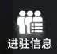

注意力涣散：

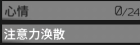

进驻：

发电站干员：

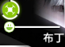

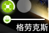

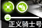

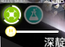

制造站种类：

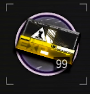

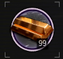

制造站（赤金）：

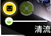

制造站（录像）：

制造站（通用）：

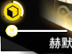

制造站（归零）：

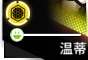

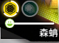

（待整理）：

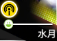

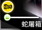

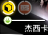

宿舍：

无人机加速：

加不了了：

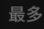

